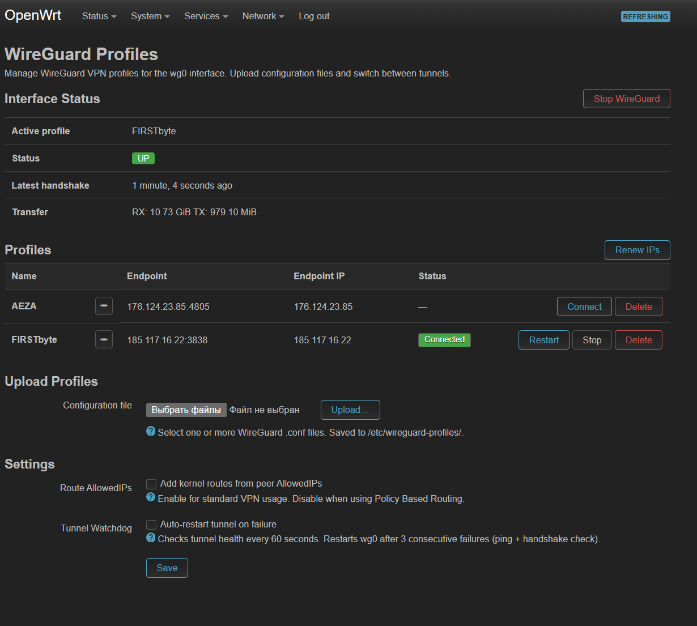
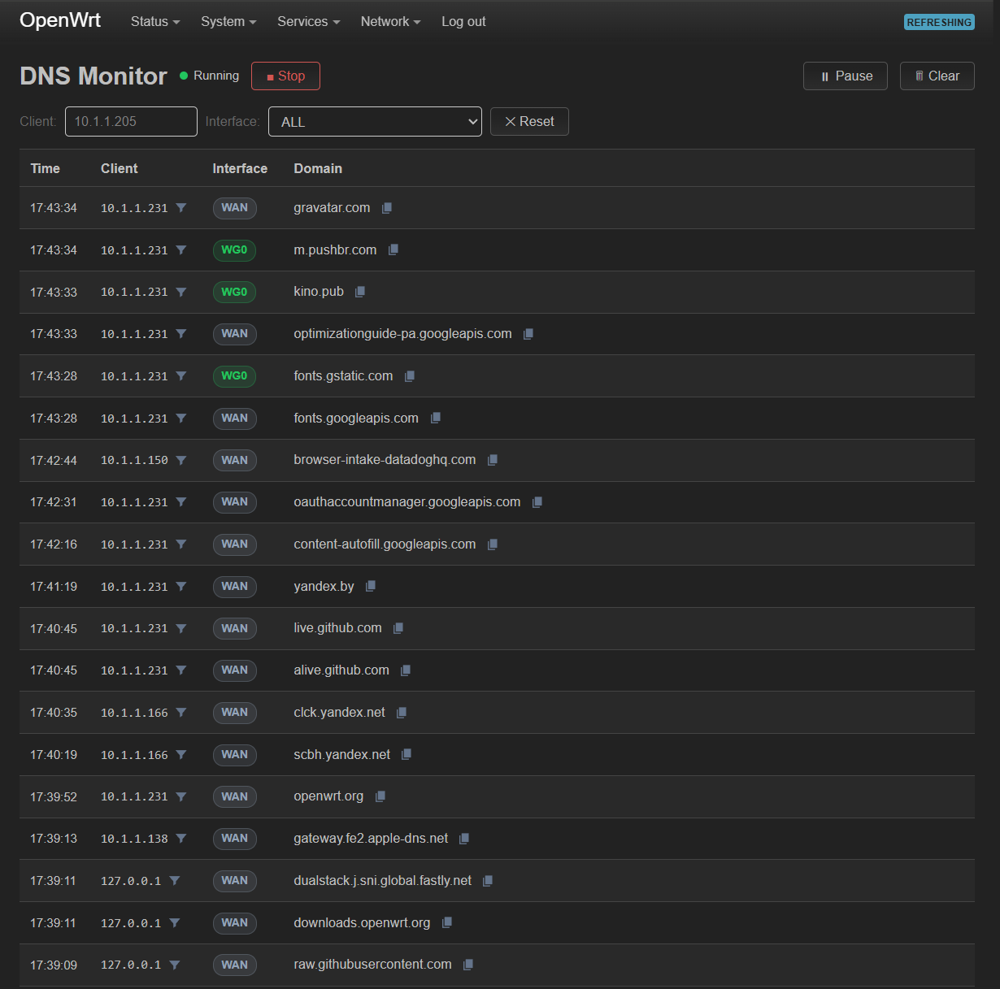
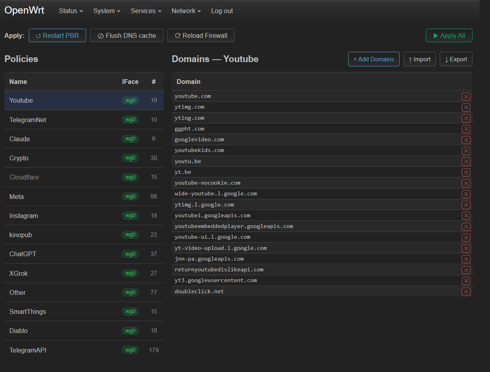
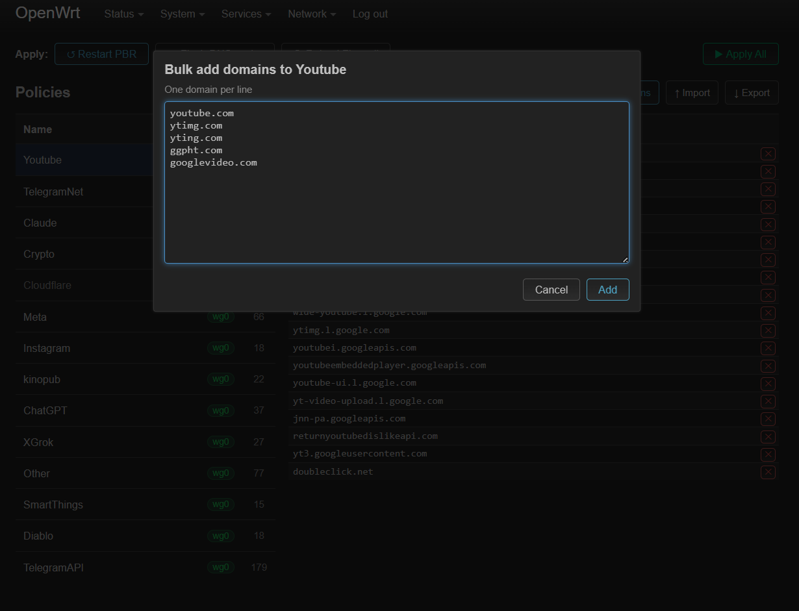

# OpenWrt Packages by snipe-dev

OpenWrt companion packages for WireGuard VPN and Policy-Based Routing management. Includes WireGuard profile switcher with watchdog, DNS traffic monitor with real-time interface detection, and PBR domain manager with bulk import/export.

---

## Packages

| Package | Description | Menu |
|---|---|---|
| `luci-app-wgprofiles` | WireGuard profile switcher with watchdog daemon | Network → WireGuard Profiles |
| `luci-app-dnsmon` | Real-time DNS traffic monitor with WG0/WAN detection | Services → DNSmon |
| `luci-app-pbrmgr` | PBR domain manager with bulk import/export | Services → PBR Manager |

---

## Requirements

- OpenWrt 23.05 or later
- LuCI web interface installed
- For `luci-app-wgprofiles`: `wireguard-tools`, `luci-proto-wireguard`
- For `luci-app-pbrmgr`: `pbr`, `luci-app-pbr`

---

## Installation

### 1. Add the repository

```sh
echo "src/gz snipe-dev https://raw.githubusercontent.com/snipe-dev/openwrt-packages/main/repo" \
    >> /etc/opkg/customfeeds.conf
```

### 2. Add the signing key

```sh
echo "untrusted comment: public key 9319cdaad1266a8a
RWSTGc2q0SZqiv06fwKX8htXFTHk4Sgj6utswhtRNNf+L7+fqkmuxN7C" > /etc/opkg/keys/9319cdaad1266a8a
```

### 3. Update package lists

```sh
opkg update
```

### 4. Install dependencies

```sh
# For wgprofiles
opkg install wireguard-tools luci-proto-wireguard
# ⚠️ Reboot required after installing wireguard-tools / luci-proto-wireguard
reboot
```

```sh
# For pbrmgr (pbr must already be installed and configured)
opkg install pbr luci-app-pbr
```

### 5. Install packages

```sh
opkg install luci-app-wgprofiles
opkg install luci-app-dnsmon
opkg install luci-app-pbrmgr
```

### 6. Restart services

```sh
/etc/init.d/rpcd restart
/etc/init.d/uhttpd restart
```

---

## Manual installation (without opkg)

Download the `.ipk` files from the `repo/` directory and install locally:

```sh
opkg install /tmp/luci-app-wgprofiles_1.0.0_all.ipk
opkg install /tmp/luci-app-dnsmon_1.0.1_all.ipk
opkg install /tmp/luci-app-pbrmgr_1.0.3_all.ipk
/etc/init.d/rpcd restart
/etc/init.d/uhttpd restart
```

---

## Package Details

### luci-app-wgprofiles



WireGuard profile manager for OpenWrt. Upload `.conf` files, switch between tunnels with one click, and keep the tunnel alive with a built-in watchdog daemon.

**Features:**
- Upload and manage multiple WireGuard `.conf` profiles
- One-click connect/disconnect/restart
- Watchdog daemon — auto-restarts tunnel on failure (ping + handshake check every 60s)
- Endpoint IP resolver for dynamic DNS endpoints
- Settings: route AllowedIPs toggle, watchdog enable/disable

**Dependencies:** `luci-base`, `wireguard-tools`, `luci-proto-wireguard`

---

### dnsmon



Real-time DNS traffic monitor. Shows which interface (WG0 or WAN) each client's traffic is routed through, based on dnsmasq nftset logs.

**Features:**
- Live table with Time / Client / Interface / Domain
- Filter by client IP and interface (ALL / WG0 / WAN)
- Click filter icon on any client IP to filter instantly
- Copy domain to clipboard with one click
- Deduplication — shows unique domains per client
- Start/Stop/Pause controls
- No extra processes — reads dnsmasq system log directly

**Dependencies:** `luci-base`

**Note:** Requires `dnsmasq-full` with nftset support and PBR configured with `resolver_set=dnsmasq.nftset`.

---

### luci-app-pbrmgr




Domain list manager for OpenWrt PBR (Policy-Based Routing). Replaces the cramped single-line domain field with a clean two-panel interface.

**Features:**
- Two-panel layout: policy groups on the left, domains on the right
- Add single domain or paste a multiline list
- Import domains from `.txt` file (one per line)
- Export domain list to `.txt` file
- Delete individual domains with one click
- Apply buttons: Restart PBR / Flush DNS cache / Reload Firewall / Apply All

**Dependencies:** `luci-base`, `pbr`, `luci-app-pbr`

**Note:** Create and delete policy groups through the standard PBR UI (`Services → Policy Routing`). PBR Manager handles domain lists inside existing groups.

---

## Recommended setup order

1. Install and configure `pbr` + `luci-app-pbr`
2. Install `luci-app-wgprofiles`, upload your WireGuard `.conf`, connect tunnel
3. Install `luci-app-dnsmon`, start monitoring — see which domains go through WAN
4. Install `luci-app-pbrmgr`, add missing domains to the correct PBR groups
5. Hit **Apply All** in PBR Manager to restart PBR and flush DNS cache

---

## Uninstall

```sh
opkg remove luci-app-dnsmon
opkg remove luci-app-pbrmgr
opkg remove luci-app-wgprofiles
```
